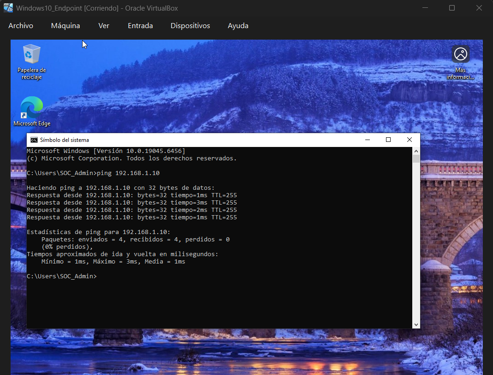
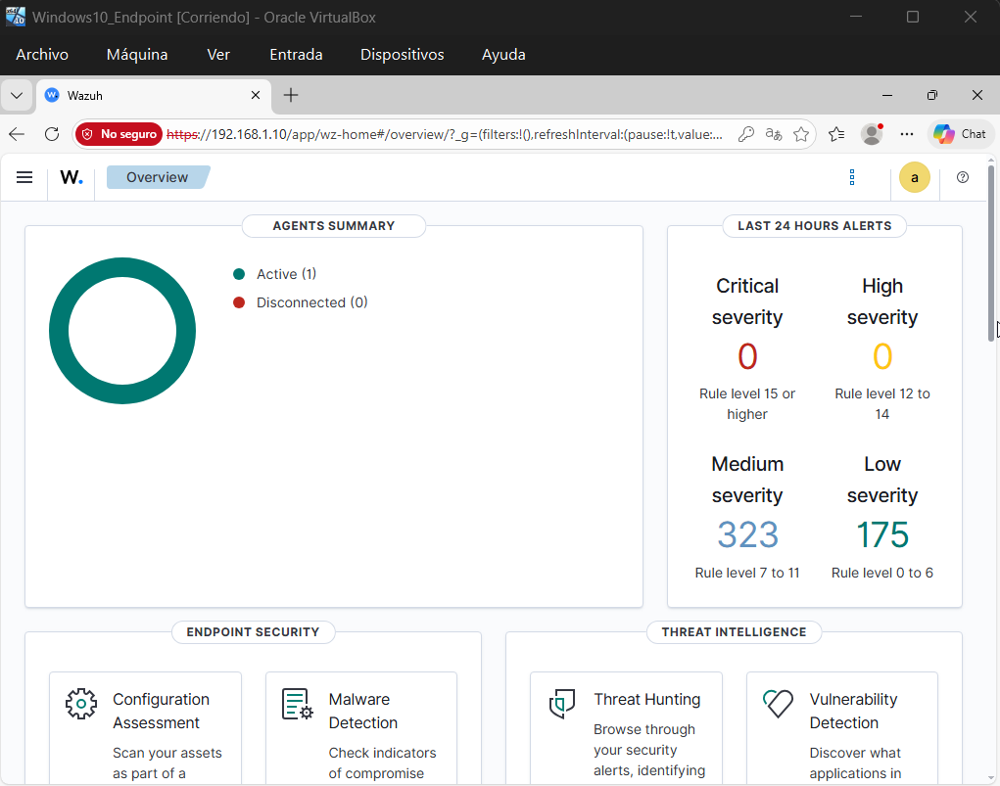
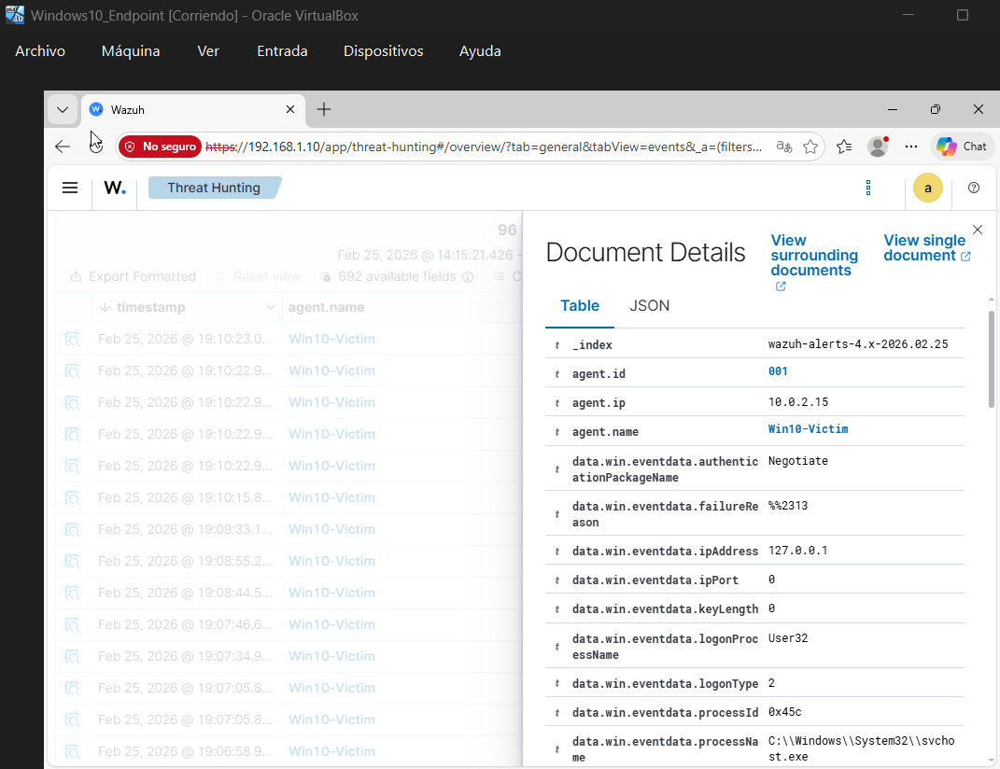

# Wazuh-SIEM-Home-Lab
Esta es una pequeña demostración de un laboratorio casero que armé, algo similar a una entorno real de Centro de Operaciones de Seguridad (SOC) en el que pude recolectar y analizar eventos de seguridad, configurando un servidor SIEM y monitoreando un endpoint de Windows.
--------------------------------------------------------------------------------------------------------------------------------------------------------------------------------------------------------
# 🛡️ Active Threat Monitoring & Threat Hunting con Wazuh SIEM

## 🎯 Objetivo del Proyecto
El objetivo de este laboratorio fue desplegar un entorno de Centro de Operaciones de Seguridad (SOC) local para recolectar, analizar y responder a eventos de seguridad en tiempo real. Se configuró un servidor SIEM y se monitoreó un endpoint de Windows para detectar anomalías y simular un flujo de trabajo real de análisis de amenazas.

## 🛠️ Tecnologías y Entorno
- **SIEM:** Wazuh (Desplegado vía OVA).
- **Endpoint Analizado:** Windows 10 LTSC.
- **Hipervisor:** Oracle VirtualBox.
- **Redes:** Configuración de Adaptador Puente (Bridged) para simulación de red corporativa LAN.
- **Herramientas:** Línea de comandos de Linux, PowerShell.

## 📝 Pasos de Implementación

### 1. Despliegue de Infraestructura y Redes
Configuré dos máquinas virtuales en VirtualBox bajo la misma red local. Verifiqué la comunicación bidireccional mediante pruebas de conectividad (ping), asegurando que el endpoint pudiera enviar telemetría al indexador.

*Prueba de conectividad exitosa desde el endpoint Windows hacia el servidor Wazuh.*

### 2. Instalación y Configuración del Agente
Inyecté el agente de Wazuh en la máquina Windows utilizando PowerShell con privilegios de administrador, forzando el inicio del servicio (`WazuhSvc`) y confirmando su estado "Active" desde el Dashboard central.

*El endpoint Windows 10 reportando telemetría en tiempo real al SIEM.*

### 3. Simulación de Ataque (Generación de Ruido)
Para probar las capacidades de detección, ejecuté un "ataque" simulado de fuerza bruta local contra el endpoint de Windows, generando múltiples intentos de inicio de sesión fallidos de manera consecutiva.

### 4. Threat Hunting y Análisis de Logs
Utilizando el módulo de Threat Hunting de Wazuh, audité los registros de seguridad. Logré identificar e investigar exitosamente los eventos críticos generados por la simulación, aislando las alertas. (Logon Failure).

*Detalle de la regla de seguridad activada tras detectar los intentos de autenticación fallidos.*

## 💡 Conclusión
Este laboratorio me permitió ganar experiencia práctica en la arquitectura de red de un SIEM, la instalación de agentes de monitoreo, y la lectura e interpretación de logs de seguridad del sistema operativo Windows, habilidades fundamentales para el análisis de incidentes (Tier 1).
